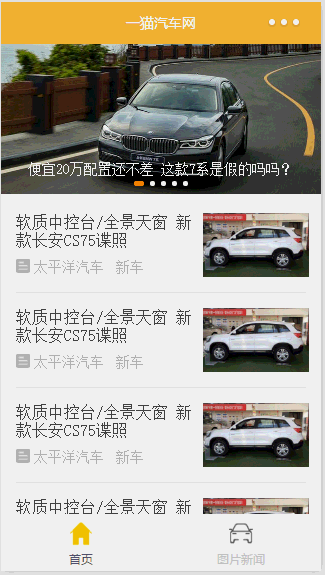
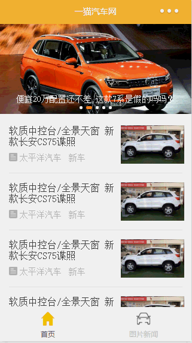

# 微信小程序-一猫汽车网
>这是一个简单模仿一猫汽车网APP的demo,两个tab页面和一个详情页，tab页面（首页和图片新闻）功能相似，主要有轮播图和新闻列表，区别是进入新闻详情页展示方式不同，一个是展示文字，一个是展示图片。

## 目录结构
    ├── app.js
    ├── app.json
    ├── app.wxss
    ├── pages
    │   ├── detail
    │   ├── index
    |   ├── newsimg
    │   └── images
    └── utils
    |    └── util.js
    └── design

## 目录结构解析
* WXML（WeiXin Markup Language）是框架设计的一套标签语言，结合基础组件、事件系统，可以构建出页面的结构。内部主要是微信自己定义的一套组件。
* WXSS(WeiXin Style Sheets)是一套样式语言，用于描述 WXML 的组件样式，
* js 逻辑处理，网络请求
* json 小程序设置，如页面注册，页面标题及tabBar。

## 配置
>我们使用app.json文件来对微信小程序进行全局配置，决定页面文件的路径、窗口表现、设置网络超时时间、设置多 tab 等。
  以下是一个包含了所有配置选项的简单配置app.json ：

`{
   "pages":[
     "pages/index/index",
     "pages/newsimg/newsimg",
     "pages/detail/detail"
   ],
  "window":{
     "backgroundTextStyle":"light",
     "navigationBarBackgroundColor": "#f3b338",
     "navigationBarTitleText": "一猫汽车网",
     "navigationBarTextStyle":"white",
     "enablePullDownRefresh": true
   },
   "tabBar": {
     "color": "#ccc",
     "selectedColor": "#35495e",
     "borderStyle": "white",
     "backgroundColor": "#f9f9f9",
     "list": [
       {
         "pagePath": "pages/index/index",
         "text": "首页",
         "iconPath": "pages/images/tab-1.png",
         "selectedIconPath": "pages/images/tab-1_1.png"
       },
       {
         "pagePath": "pages/newsimg/newsimg",
         "text": "图片新闻",
         "iconPath": "pages/images/tab-2.png",
         "selectedIconPath": "pages/images/tab-2_2.png"
       }
     ]
   }
}`

## 教程
[官方文档](https://mp.weixin.qq.com/debug/wxadoc/dev/index.html)

## 页面信息

